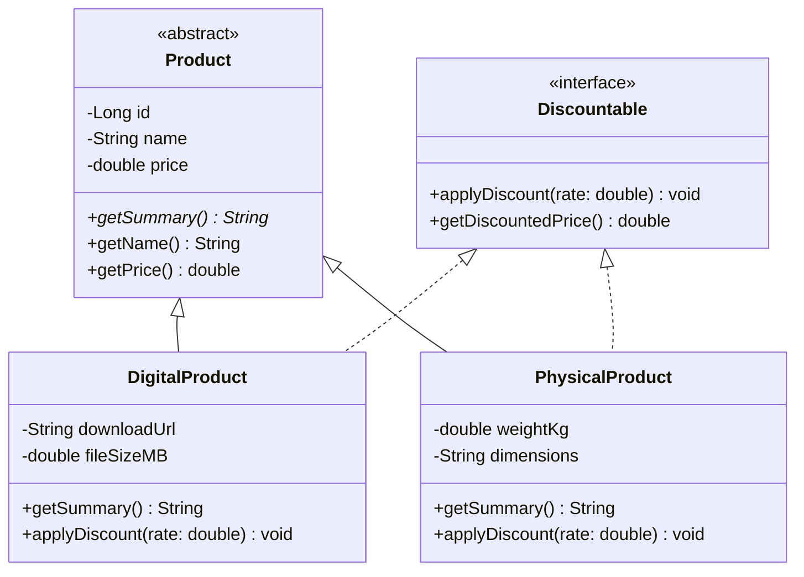

```mermaid
classDiagram
    class Product {
        <<abstract>>
        -Long id
        -String name
        -double price
        +getSummary()* String
        +getName() String
        +getPrice() double
    }

    class Discountable {
        <<interface>>
        +applyDiscount(rate: double) void
        +getDiscountedPrice() double
    }

    class DigitalProduct {
        -String downloadUrl
        -double fileSizeMB
        +getSummary() String
        +applyDiscount(rate: double) void
    }

    class PhysicalProduct {
        -double weightKg
        -String dimensions
        +getSummary() String
        +applyDiscount(rate: double) void
    }

%% generalisation (extends): SOLID line
    Product <|-- DigitalProduct
    Product <|-- PhysicalProduct

%% realisation (implements): DASHED line
    Discountable <|.. DigitalProduct
    Discountable <|.. PhysicalProduct
```